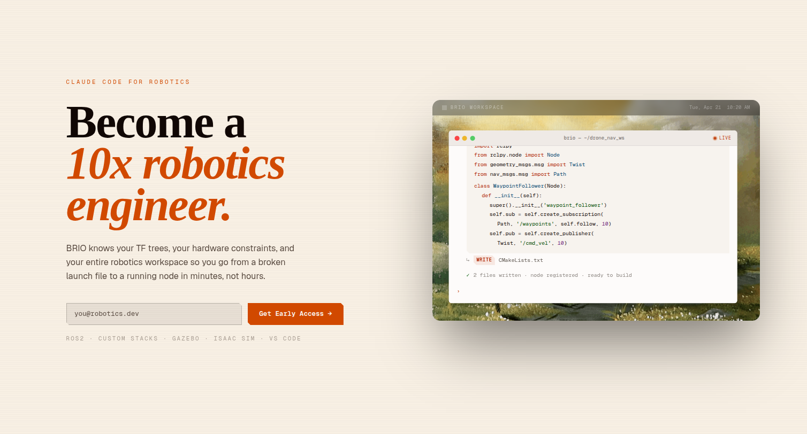

# Welcome to BRIO

**BRIO is the AI dev tool for robotics engineers.**

It connects to your live ROS 2 environment, reads your active topic
graph, transform tree, diagnostics, and hardware constraints, and
reasons about your robot the way a senior teammate would — then
writes, builds, and verifies code that runs on the actual machine.

## What BRIO does

- **Sees your robot, not just your code.** Snapshots your live
  workspace — TF tree, node list, `/diagnostics`, custom message
  types — and feeds that state to a Claude-powered supervisor agent.
- **Knows your hardware by name.** Jetson power envelope,
  carrier-board specs, sensor constraints, latency budgets. Generic
  AI doesn't know your 5V PAB requirement. BRIO does.
- **Ships code that builds first try.** Nodes with correct message
  types and QoS, launch files wired to your package, package config
  that matches your stack — generated, built, and verified against
  your real workspace.
- **Closes the simulation loop.** No more `Build → Launch → Observe`
  for every line change. The agent runs the loop for you and digs
  through stdout when things crash.
- **Reasons over live robot state.** An optional Jetson-side ROS 2
  node streams `RobotState` (TF + diagnostics + node list) so the
  agent sees what your robot is *actually* doing, not what your code
  says it should.

## Who BRIO is for

Robotics engineers who are done losing days to problems that
shouldn't take days:

- **Solo engineers** shipping client projects on tight timelines.
- **Small teams** that want the development velocity web devs take
  for granted.
- **R&D groups** building autonomous systems on ROS 2 — drones,
  ground vehicles, manipulators, naval platforms.
- **Anyone** tired of debugging async messages, chasing TF errors,
  and discovering that AI-generated code dies on the Jetson.

## Get started

Install the CLI in one line:

```bash
curl -fsSL https://github.com/getbrio/brio-releases/releases/latest/download/install.sh | bash
```

Then head to **[Installation](/docs/installation)** for platform notes
and **[Configuration](/docs/configuration)** to sign in and approve your
device.

[**→ Install BRIO**](/docs/installation)
